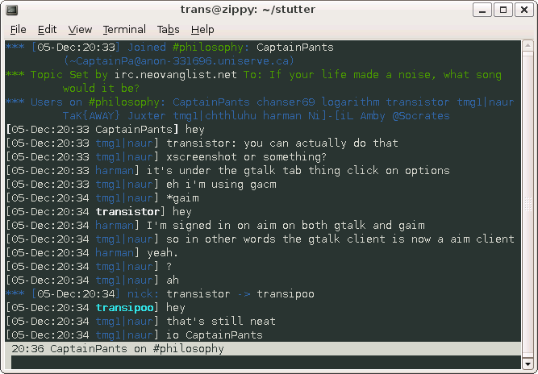

Stutter
=======

###### *Started April 23, 2005*

Stutter was an ambitious and very failed attempt at a program that did everything and anything,
but it was primarily an IRC client.  It is written entirely in C.  Stutter was intended to be
a highly dynamic communications platform in which modules that implement different protocols
could be compiled in or dynamically loaded to provide functionality.  A lightweight backened and
highly configurable modules allowed a simple hard-coded binary to be compiled, to maximum speed,
or a full-featured binary that allowed dynamic loading of modules.

Screenshot
----------

News
----

##### Version 0.4 Released...
*June 06, 2008*
It has been a lot longer than needed for this release.  I stopped working on this a while ago never released it.  I have
begun heavily refactoring the code of what will become 0.5 so I figured I should release 0.4 first.  I've lost track of
the various changes I've made since the previous release.
{: .entry }

##### Version 0.3.2 Released!
*February 08, 2007*
Another bugfix release is out.  A few minor bugs fixed and a segfault bug fixed.  A changelog has now been included.
{: .entry }

##### Version 0.3.1 Released!
*February 04, 2007*
A first ever bugfixes release!  The input history not scrolling more than 1 line has been fixed.  It is now possibly to
bind key sequences greater than one character without a segfault.  Bindings for keys with numeric characters greater
than 128 will now actually work!  Also fixed is a segfault that occurred when connecting to some servers.
{: .entry }

##### Version 0.3 Released!
*January 22, 2007*
Version 0.3 has been released.  Again, it's been almost 8 months since the last release I think.  Once again, as well,
most of the improvements are to the backend.  I have added a windows frontend however (but no new modules).  Colour is
now supported as well.  Any comments would be greatly appreciated.  Thanks.
{: .entry }

##### Version 0.2 Released!
*June 08, 2006*
Version 0.2 is finally out!  It's been almost 8 months since my first release and about a year since I first started
working on what eventually became stutter.  Most of the changes are improvements to the backend.  The variables system
is now quite advanced and the a simple signals system has been added which I hope to make more advanced in time.  The
frontend looks the same even though the code has changed quite a bit.  Hopefully I will have more than one frontend
for the next release (as well as some new modules).  Error handling and report still leaves a lot to be desired.
{: .entry }

##### Version 0.1 Released!
*November 11, 2005*
Version 0.1 has been released.  There are probably lots of bugs but I just wanted to get something out.  The main
things it the basic organization.  If anyone has any comments on the organization, structure, or anything else I'd
be glad to hear them.  Plans for the next release include new commands, a more advanced frontend, and possibly new
module for something to try out the module interface stuff as well as the usual bug fixes.
{: .entry }

